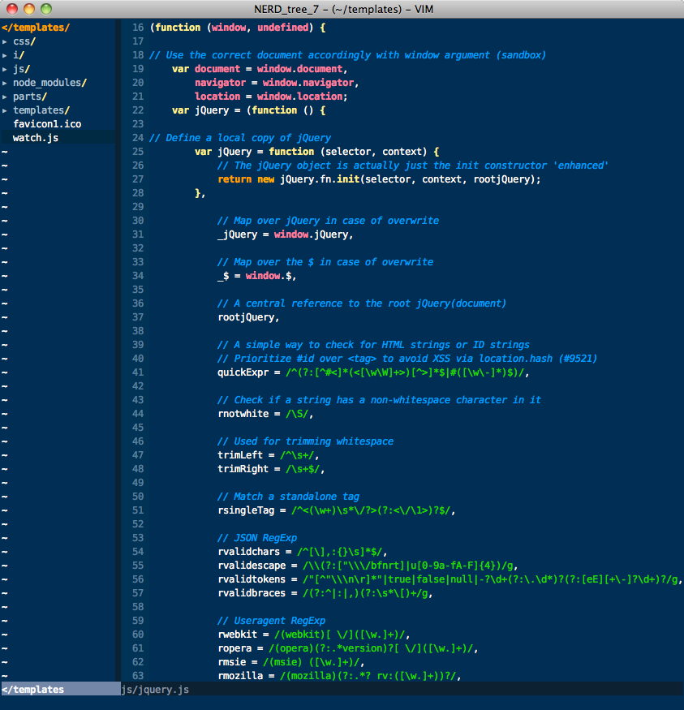

#Vim Cobalt Colour Scheme

Author: David Terei(cobaltish.vim and cobalt.vim) and Konstantin Gorodinskiy(cobalt.vim)

This is a colour scheme for vim that attempts to look as similar to the Cobalt
colour scheme from TextMate as is possible. How well this works depends
slightly on the language in use. Currently C based languages and Haskell are
well supported.

